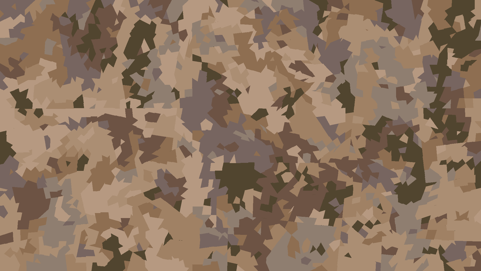
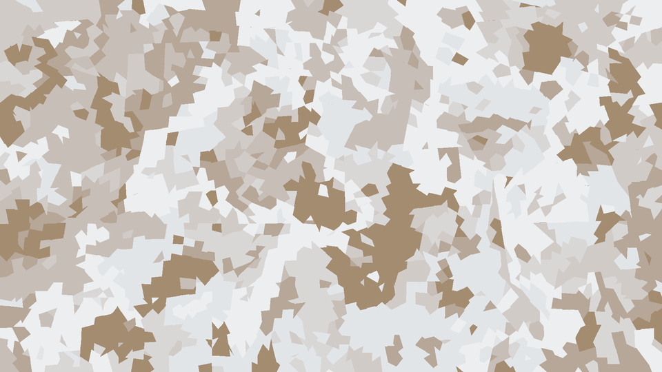

# camogen 

(**camo**uflage **gen**erator)

## installation 
```[bash]
$ pip install https://github.com/rwev/camogen/archive/master.zip
```

## usage
```[python]
import camogen

parameters = {'width': 700, 'height': 700, 'polygon_size': 400, 'color_bleed': 0,
              'colors': ['#668F46', '#4A6B3A', '#145000', '#003022']}

image = camogen.generate(parameters)
```

where `image` is of type `PIL.Image`.

### parameters

The parameters given is a Python dictionary. The following parameters are mandatory:

| Parameter    | Type        |  Description                                                                                          |
| ------------ | ------------ | ----------------------------------------------------------------------------------------------------- |
| width        | Int          | Width of the image (Minimum value: 0)                                                                 |
| height       | Int          | Height of the image (Minimum value: 0)                                                                  |
| polygon_size | Int          | Minimum perimeter of a polygon (Minimum value: 0)                                                     |
| color_bleed  | Int          | Bleeding of the colors, *i.e.* number of neighbouring polygons with the same color (Minimum value: 0) |
| colors       | list[String] | List of all the colors. Colors have to be a Hex String. (Minimum size: 1)                             |
| max_depth    | Int          | (**Optional**) Maximum depth for creating the polygons. (Default value: 15)                           |

The next set of parameters adds spots on the camouflage. In the dictionary, you have to add these parameters with the key
`spots`. If you want to add spots, all these parameters are mandatory:

| Parameter          | Types |  Explanation                                                                                  |
| ------------------ | ----- | --------------------------------------------------------------------------------------------- |
| amount             | Int   | Number of spots (Minimum value: 0)                                                            |
| radius             | dict  | Dictionary with the min and max radius (Example: `{'min': 0, 'max': 10}`), Minimum values: 0) |
| sampling_variation | Int   | Variation for the sampling, *i.e.* how far it goes looking for the color for the spot.  |

The next set of parameters pixelizes the camouflage. In the dictionary, you have to add these parameters with the key
`pixelize`. If you want to pixelize the camouflage, all these parameters are mandatory:

| Parameter          | Types |  Explanation                                                                                        |
| ------------------ | ----- | -------------------------------------------------------------------------------------------------- |
| amount             | float | Percentage of pixelization (Between 0 and 1)                                                       |
| sampling_variation | Int   | Variation for the sampling, *i.e.* how far it goes looking for the color for the spot.             |
| density            | dict  | Density of the pixels, *i.e.* inverse of the size of the pixels. (Example: `{'x': 100, 'y': 200}`) |

You can find examples how to generate some camouflage in the file `examples.py`

## examples

These camouflage patterns are generated using color palettes from [pypalette](https://gitlab.com/rwev/pypalette). See `examples.py` for their parametrization.  

#### coyote summer


#### coyote winter


### TODO
- save parametrization as metadata to image
- file watcher integration (generate and update on parametrization change) 
